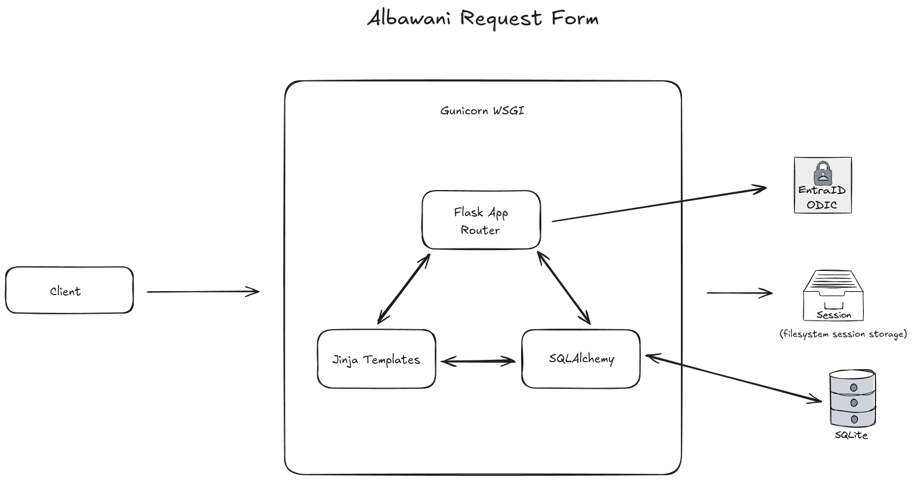

# Al Bawani Attendance Request Portal


A secure, web-based portal for Albawani employees to request attendance reports. This application features Microsoft Azure Entra ID (Azure AD) authentication, a responsive UI built with Tailwind CSS, and a Flask backend for processing requests.

## System Architecture



* **Secure Authentication**: Integrated with Azure Entra ID using MSAL for secure employee login.
* **Request Management**: Simple interface for selecting date ranges for attendance reports.
* **Validation**: Server-side and client-side validation to ensure start dates do not exceed end dates.
* **Database Integration**: SQLite storage using SQLAlchemy ORM for tracking requests.

## Project Structure

```bash
albawani-request-form/
├── .env.sample             # Template for environment variables
├── auth.py                 # Azure MSAL authentication logic
├── config.py               # Application configuration & Pydantic settings
├── db.py                   # Database connection and models
├── main.py                 # Application entry point and routes
├── formdata.db             # SQLite database file
├── requirements.txt        # Python dependencies
├── static/                 # Static assets (CSS, JS, Images)
│   ├── assets/             # Logos and background images
│   ├── script.js           # Client-side logic
│   └── styles.css          # Custom overrides
└── templates/              # HTML Templates (Jinja2)
    ├── attendance.html
    ├── base.html
    ├── employees.html
    └── index.html
```

## Environment Setup

1. Prepare the enviromment. It is recommended that you use Python 3.13 and venv.

```
python3 -m venv albawani-request-form
```

2. Activate the environment.
```
source albawani-request-form/bin/activate
```

3. Install dependencies and packages (Unlikely to get conflicts if you have venv, let the dependency resolver do its thing).

```
pip install -r requirements.txt
```

## Startup Command

The app is configured to run on port 8000. If you do not like it, you may have to tweak `const BACKEND_URL` in `script.js`.

### Recommended Development Startup Command
Do not use this in prod.
```
python3 main.py

```

### Recommended Production Startup Command
Modify workers depending on VM cpu threads (2 is good enough)
```
gunicorn --workers 2 --worker-connections 1000 --max-requests 1000 --bind 0.0.0.0:8000 --timeout 1000 main:app 

```
## EntraID Setup

You will need to add your own EntraID instance, and specific to Albawani Email holders. For demo purposes, I hardcoded the url redirect (once the token is accepted) to `localhost:8000`. To start, you will need the following.

1. Go to Azure Portal (or EntraID Admin Center)
2. From the Portal or Admin center, go to **App Registrations** and create a **New Registration**.
3. You will need the following details: (if they are not defined, go create them) 
    * Application (client) ID
    * Client credentials (create a secret)
    * Directory (tenant) ID
4. Add Redirect URIs (web) that corresponds to either localhost (local testing) or your custom domain.
5. Create a `.env` file (refer to `.env.sample`)
6. Add `SECRET_KEY` for Flask session hash

